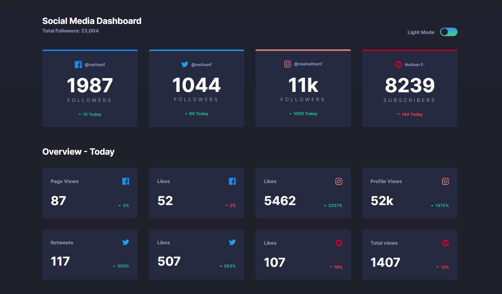
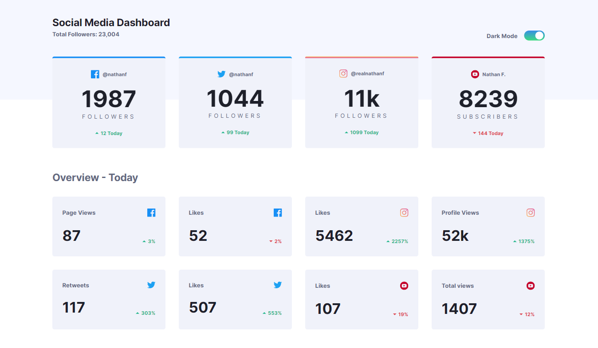

# Frontend Mentor - Social media dashboard with theme switcher solution

This is a solution to the [Social media dashboard with theme switcher challenge on Frontend Mentor](https://www.frontendmentor.io/challenges/social-media-dashboard-with-theme-switcher-6oY8ozp_H).

## Table of contents

- [Overview](#overview)
  - [The challenge](#the-challenge)
  - [Screenshot](#screenshot)
  - [Links](#links)
- [My process](#my-process)
  - [Built with](#built-with)
  - [What I learned](#what-i-learned)
  - [Useful resources](#useful-resources)
- [Author](#author)
- [Acknowledgments](#acknowledgments)

## Overview

### The challenge

Your challenge is to build out this landing page and get it looking as close to the design as possible.

The only JavaScript required is for the color theme toggle.

Your users should be able to:
- View the optimal layout for the site depending on their device's screen size;
- See hover states for all interactive elements on the page;
- Toggle color theme to their preference;

### Screenshot

#### Dark Mode Desktop 1440x840

#### Light Mode Desktop 1440x840

### Links

- Live Site URL: [Social Media Dashboard](https://social-media-dashboard-one-jet.vercel.app/)

## My process

### Built with

- Semantic HTML5 markup
- CSS custom properties
- Flexbox
- CSS Grid
- JavaScript

### What I learned

With this challenge I was able to put in practice some concepts about:
- CSS Grid;
- CSS Custom Properties to manipulate the user preferred theme;
- And accessibility attributes;

### Useful resources

These contents helped with CSS Grid:
- [Grid Garden](http://cssgridgarden.com/);
- [Tutorial youtube video](https://youtu.be/rg7Fvvl3taU);

## Author

- LinkedIn - [Mariane Felix](https://www.linkedin.com/in/mariane-felix/)
- Frontend Mentor - [@marianefelix](https://www.frontendmentor.io/profile/marianefelix)